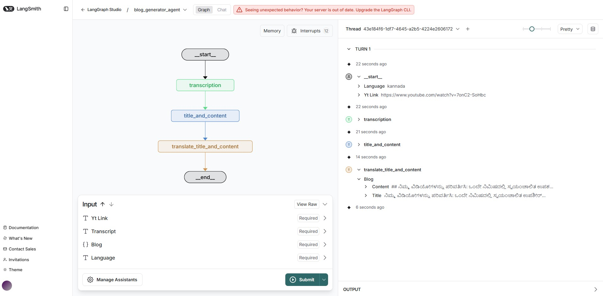
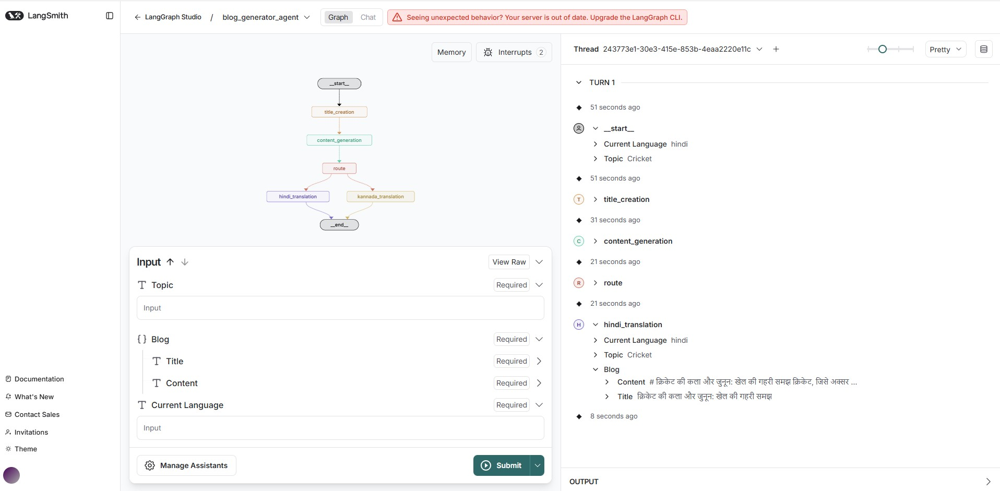

# youtube-blog-generator
YouTube blog generator is an AI-powered tool that automatically converts YouTube videos into well-structured, SEO-friendly blog articles using LangGraph and Large Language Models (LLMs). It supports multi-language blog generation.

# Youtube blog generator


# Blog generator by topic


## Features

- Converts YouTube videos into structured blog articles automatically
- Utilizes LangGraph and Large Language Models (LLMs) for content generation
- Supports multi-language blog creation
- Generates SEO-friendly content
- Simple and user-friendly API

## Getting Started

### Prerequisites

- Python 3.8+
- [pip](https://pip.pypa.io/en/stable/installation/)
- Azure OpenAI API key
- YouTube Link
- UV package

### Installation

```bash
git clone https://github.com/iamchandanys/youtube-blog-generator.git
cd youtube-blog-generator
uv add -r requirements.txt
```

### Usage

1. Set your API keys in a `.env` file:
    ```
    AZURE_OPENAI_API_KEY=your_azure_openai_key
    AZURE_OPENAI_ENDPOINT=your_azure_openai_endpoint
    OPENAI_API_VERSION=2025-01-01-preview
    AZURE_OPENAI_DEPLOYMENT_NAME=your_azure_openai_deployment_name
    ```

2. Run the API:
    ```bash
    python app.py
    ```

3. Use the `/generate-yt-blog` endpoint to generate a blog article.  
   Send a POST request with the following JSON body:
    ```json
    {
      "yt_link": "",
      "language": ""
    }
    ```
   Example using `curl`:
    ```bash
    curl -X POST http://localhost:8000/generate-yt-blog \
      -H "Content-Type: application/json" \
      -d '{"yt_link": "YOUR_YOUTUBE_LINK", "language": "english"}'
    ```

### Command Line Arguments

- `--yt_link`: YouTube video URL (required)
- `--language`: Output language (required)  

## Technologies Used

- Python
- LangGraph
- OpenAI GPT (or other LLMs)
- YouTube Data API